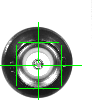
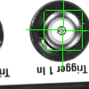
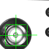
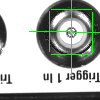
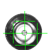
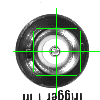

# Deep learning-based localization of electrical connector sockets for automated mating
[Download the paper](https://link.springer.com/article/10.1007/s11740-024-01299-7)

Implementation of the paper "Deep learning-based localization of electrical connector sockets for automated mating". For further information, please check the publication. 
Cite as:
```
@article{beck2024deep,
  title={Deep learning-based localization of electrical connector sockets for automated mating},
  author={Beck, Leopold and Gebauer, Daniel and Rauh, Thomas and Dirr, Jonas and Daub, R{\"u}diger},
  journal={Production Engineering},
  pages={1--8},
  year={2024},
  publisher={Springer},
  doi={https://doi.org/10.1007/s11740-024-01299-7}
}
```

### Abstract
The mating of electrical connectors (ECs) is predominantly carried out manually in today’s production due to small required tolerances between the plug and its socket. Automating this process offers economic incentives due to the widespread use of ECs. To achieve this, a deep learning-based 2D computer vision system is proposed for a precise localization of sockets. Herefore, a modified U-Net for keypoint prediction with heatmaps is developed and tailored for a production-like scenario. This method outperforms a commercial state-of-the-art template-based matching algorithm on five out of six EC types. In an experimental evaluation, the robot autonomously mated 75–100% of ECs successfully, depending on the EC type.

### Paper TLDR
CNN -> Heatmaps -> DSNT -> Keypoints -> PnP -> Object Pose Estimation  
Very lightweight model; Validation doesn't need labeled data; Works well with very difficult textures such as metallic surfaces with reflections; Limited to use cases where poses differ only minimally and parts almost don't;


### Exemplary keypoint predictions
The following images show exemplary test results of the trained model (see src/train_test_BNC.ipynb). Predicted keypoints of the socket's 4 extreme points are annotated with green crosses.








Note that src/train_test_BNC shows a slightly advanced training process using images with reprojected keypoints as training data
